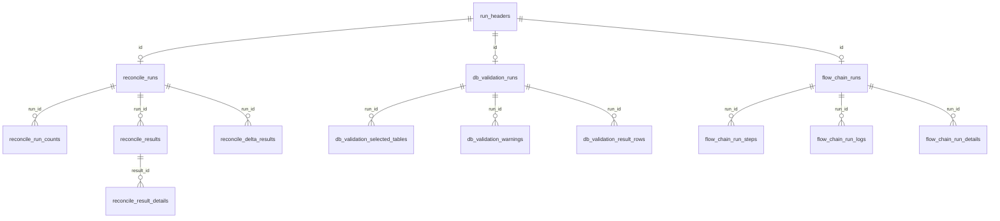

# 本地 SQLite 数据库设计说明

> 历史迁移与回滚参考：当前运行版本不再使用 SQLite 作为应用存储。系统自身配置、用户和历史记录已切换到 MySQL 应用库 `auto_check`，本文件仅用于理解旧 `auto-check.db` 结构、离线导出和回滚场景。

本文档说明 Auto Check（监管智核）本地 SQLite 数据库 `auto-check.db` 的结构设计、表用途、关系约束和旧数据迁移策略。

## 一、定位与范围

`auto-check.db` 只保存系统自身数据，不保存业务库原始数据，也不写入 DWS 或报表库。

主要保存内容包括：

- 系统配置、数据源配置和用户账号。
- 自动对数历史、人行逐笔校验历史、流程链执行历史。
- 旧版 JSON/旧表兼容快照和迁移记录。

数据库文件位置：

```text
默认路径：%APPDATA%\auto-check\auto-check.db
自定义配置：与 --config 指定的 config.json 同目录，例如 D:\xxx\auto-check.db
```

当前 schema 版本由 `src/auto_check/app/storage_schema.py` 中的 `CURRENT_SCHEMA_VERSION` 管理，当前版本为 `2`。

## 二、设计原则

- 结构化热字段：列表、筛选、统计、排序常用字段拆到关系表。
- 兼容快照：完整 payload 继续保存在 JSON 快照列或旧兼容表中，保证旧功能和详情还原不受影响。
- 迁移幂等：同一来源同一指纹只迁移一次，旧历史迁移由管理员手动触发，完成后不能重复迁移。
- 旧数据保留：迁移后不删除旧 `app_kv`、`history_runs` 和旧 JSON 文件来源。
- 级联删除：结构化历史表通过外键 `ON DELETE CASCADE` 保证删除运行头时自动清理子表。
- 本地单实例：该数据库按单机本地文件使用，不设计多进程或多服务器并发写入。

## 三、表总览

| 分类 | 表名 | 中文名 | 主键 | 说明 |
|------|------|--------|------|------|
| 兼容与迁移 | `app_kv` | 旧版键值快照表 | `key` | 保留旧版 `config_store`、`auth` 等键值快照，作为兼容回退来源。 |
| 兼容与迁移 | `history_runs` | 旧版历史兼容表 | `(kind, id)` | 保留旧版历史 payload，按 `kind` 区分 `reconcile`、`db_validation`、`flow_chain`。 |
| 兼容与迁移 | `config_snapshots` | 配置兼容快照表 | `id` | 保存完整配置 payload 快照，便于兼容旧结构和后续排查。 |
| 兼容与迁移 | `schema_migrations` | 存储结构版本表 | `version` | 记录本地 SQLite schema 已执行到的版本。 |
| 兼容与迁移 | `storage_migration_runs` | 数据迁移记录表 | `id` | 记录旧 SQLite/旧 JSON 来源的迁移路径、指纹、条数和状态。 |
| 兼容与迁移 | `sqlite_sequence` | SQLite 自增序列表 | 无显式主键 | SQLite 内部表，用于维护 `AUTOINCREMENT` 序列，不属于业务表。 |
| 配置与用户 | `data_sources` | 数据源配置表 | `id` | 保存 DWS、报表库等本地数据源连接配置和默认标记。 |
| 配置与用户 | `app_settings` | 应用设置表 | `key` | 保存系统设置、默认设置、人行逐笔校验设置、流程工具设置等结构化配置。 |
| 配置与用户 | `users` | 用户账号表 | `id` | 保存用户、角色、状态、密码哈希和登录时间。 |
| 历史公共 | `run_headers` | 历史运行头表 | `id` | 保存各类历史运行的公共字段和完整 payload 快照。 |
| 自动对数 | `reconcile_runs` | 自动对数运行表 | `id` | 保存自动对数运行摘要、配置名称、规则版本和增量数量。 |
| 自动对数 | `reconcile_run_counts` | 自动对数运行统计表 | `(run_id, count_type, label)` | 保存匹配状态、差异类型等聚合统计。 |
| 自动对数 | `reconcile_results` | 自动对数结果明细表 | `id` | 保存项目编号、差异类型、匹配状态、差异金额等结果热字段。 |
| 自动对数 | `reconcile_result_details` | 自动对数结果详情表 | `id` | 保存结构化详情类型、具体原因和详情 payload。 |
| 自动对数 | `reconcile_delta_results` | 自动对数增量差异表 | `(run_id, delta_type, result_order)` | 保存本次新增差异和减少差异快照。 |
| 人行逐笔校验 | `db_validation_runs` | 人行逐笔校验运行表 | `id` | 保存逐笔校验报告期、结果数、告警数、校验开关和下载路径。 |
| 人行逐笔校验 | `db_validation_selected_tables` | 人行逐笔校验选表明细表 | `(run_id, table_order)` | 保存一次逐笔校验运行中勾选的 ZG 表清单。 |
| 人行逐笔校验 | `db_validation_warnings` | 人行逐笔校验告警表 | `(run_id, warning_order)` | 保存一次逐笔校验运行产生的告警信息。 |
| 人行逐笔校验 | `db_validation_result_rows` | 人行逐笔校验结果行表 | `id` | 保存逐笔校验结果行的表号、规则、级别、消息和完整行快照。 |
| 流程链 | `flow_chain_runs` | 流程链执行运行表 | `id` | 保存流程链名称、触发方式、执行人、状态、错误、步骤数和总耗时。 |
| 流程链 | `flow_chain_run_steps` | 流程链执行步骤表 | `id` | 保存每个流程步骤的流程编号、名称、状态、任务号和起止时间。 |
| 流程链 | `flow_chain_run_logs` | 流程链执行日志表 | `id` | 保存流程链执行过程中的日志、进度和当前步骤。 |
| 流程链 | `flow_chain_run_details` | 流程链执行链路明细表 | `id` | 保存单链路或多链路合并历史中的链路详情。 |

## 四、核心关系

历史数据统一以 `run_headers` 作为运行头，再按业务类型拆到各自明细表。



关系说明：

- `run_headers.kind` 标识历史类型：`reconcile`、`db_validation`、`flow_chain`。
- `run_headers.payload_json` 保存完整历史 payload，详情页和兼容读取优先从这里还原。
- `reconcile_runs.id`、`db_validation_runs.id`、`flow_chain_runs.id` 均引用 `run_headers.id`。
- 各明细表引用所属运行表，删除运行头时由外键级联清理结构化明细。
- `history_runs` 与结构化历史并存，用于旧版本兼容和迁移回退，不参与新查询主路径。

## 五、配置与用户表

### `data_sources` 数据源配置表

保存本地维护的数据源连接信息。密码不明文存储，写入 `password_encrypted`。

关键字段：

- `id`：数据源唯一编号。
- `name`：数据源显示名称。
- `db_type`：数据库类型，目前支持 `postgresql`、`mysql`。
- `host`、`port`、`database_name`、`schema_name`、`username`：连接信息。
- `password_encrypted`：加密后的数据库密码。
- `is_default`：是否默认数据源。

### `app_settings` 应用设置表

按 `key/value_json` 保存结构化设置。

典型 key 包括：

- 默认系统设置。
- 人行逐笔校验配置。
- 流程工具配置。
- 对账业务字段配置。

### `users` 用户账号表

保存本地用户账号，不保存明文密码。

关键字段：

- `username`：登录名，唯一。
- `display_name`：展示名。
- `role`：用户角色。
- `password_hash`：密码哈希。
- `enabled`：是否启用。
- `last_login_at`：最近登录时间。

## 六、历史公共表

### `run_headers` 历史运行头表

保存三类历史记录的公共字段。

关键字段：

- `id`：一次运行的唯一编号。
- `kind`：历史类型。
- `run_date`：业务日期或报告期。
- `run_at`、`finished_at`：执行开始和完成时间。
- `status`：执行状态。
- `executor_id`、`executor_username`、`executor_name`：执行人信息。
- `config_fingerprint`：配置指纹。
- `payload_json`：完整历史 payload 快照。

排序索引：

- `idx_run_headers_sort(kind, run_date DESC, run_at DESC)`

## 七、自动对数历史表

### `reconcile_runs` 自动对数运行表

保存自动对数摘要字段。

关键字段：

- `id`：引用 `run_headers.id`。
- `config_name`、`dws_source_name`：执行时使用的数据源名称。
- `rule_version`：规则版本。
- `baseline_id`、`baseline_run_at`、`baseline_count`：基准历史信息。
- `total_count`、`added_count`、`removed_count`：差异总数和增量数量。

### `reconcile_run_counts` 自动对数运行统计表

保存按类型聚合的统计值。

关键字段：

- `run_id`：引用 `reconcile_runs.id`。
- `count_type`：统计类型，例如匹配状态、差异原因。
- `label`：统计标签。
- `count_value`：统计值。

### `reconcile_results` 自动对数结果明细表

保存列表、统计、筛选常用的结果热字段。

关键字段：

- `run_id`：引用 `reconcile_runs.id`。
- `result_order`：结果顺序。
- `project_code`、`project_name`：项目编号和名称。
- `asset_total`、`liability_equity_total`、`received_trust_balance`：关键金额。
- `difference`、`direction`：差异金额和方向。
- `difference_reason`、`match_status`：差异类型和匹配状态。
- `payload_json`：单条结果完整快照。

索引：

- `idx_reconcile_results_run(run_id, result_order)`
- `idx_reconcile_results_project(project_code)`
- `idx_reconcile_results_reason(difference_reason, match_status)`

### `reconcile_result_details` 自动对数结果详情表

保存结构化详情块，支持按详情类型和具体原因扩展。

关键字段：

- `result_id`：引用 `reconcile_results.id`。
- `detail_order`：详情顺序。
- `kind`：详情类型。
- `specific_reason`：具体原因。
- `data_json`：详情数据快照。

### `reconcile_delta_results` 自动对数增量差异表

保存新增差异和减少差异。

关键字段：

- `run_id`：引用 `reconcile_runs.id`。
- `delta_type`：`added` 或 `removed`。
- `result_order`：增量结果顺序。
- `payload_json`：增量结果快照。

## 八、人行逐笔校验历史表

### `db_validation_runs` 人行逐笔校验运行表

保存逐笔校验运行摘要。

关键字段：

- `id`：引用 `run_headers.id`。
- `report_date`：报告期。
- `result_count`、`warning_count`、`table_count`：结果、告警、选表数量。
- `enable_public_info_check`、`enable_template_check`：校验开关。
- `excel_filename`、`excel_path`、`download_url`：结果文件和下载地址。

### `db_validation_selected_tables` 人行逐笔校验选表明细表

保存一次运行选中的 ZG 表。

关键字段：

- `run_id`：引用 `db_validation_runs.id`。
- `table_order`：选表顺序。
- `table_code`：ZG 表编号。

### `db_validation_warnings` 人行逐笔校验告警表

保存运行过程告警。

关键字段：

- `run_id`：引用 `db_validation_runs.id`。
- `warning_order`：告警顺序。
- `message`：告警内容。

### `db_validation_result_rows` 人行逐笔校验结果行表

保存逐笔校验结果行热字段和完整快照。

关键字段：

- `run_id`：引用 `db_validation_runs.id`。
- `row_order`：结果顺序。
- `table_code`：表编号。
- `rule_id`：规则编号。
- `severity`：级别。
- `message`、`detail`：结果消息和详情。
- `payload_json`：完整结果行快照。

索引：

- `idx_db_validation_runs_sort(report_date DESC)`
- `idx_db_validation_result_rows_run(run_id, row_order)`

## 九、流程链执行历史表

### `flow_chain_runs` 流程链执行运行表

保存一次流程链执行摘要。

关键字段：

- `id`：引用 `run_headers.id`。
- `chain_id`、`chain_name`：链路编号和名称。
- `is_multi_chain`：是否多链路合并记录。
- `trigger_type`：触发方式。
- `executor_name`：执行人名称。
- `status`、`error`：执行状态和错误信息。
- `step_count`、`duration_seconds`：步骤数和总耗时。

### `flow_chain_run_steps` 流程链执行步骤表

保存每个流程步骤。

关键字段：

- `run_id`：引用 `flow_chain_runs.id`。
- `step_order`：步骤顺序。
- `flow_id`、`name`：流程编号和名称。
- `status`：步骤状态。
- `sp_task_id`：申报平台任务号。
- `start_time`、`end_time`、`duration_seconds`：步骤时间。
- `payload_json`：步骤快照。

索引：

- `idx_flow_chain_run_steps_run(run_id, step_order)`

### `flow_chain_run_logs` 流程链执行日志表

保存执行日志。

关键字段：

- `run_id`：引用 `flow_chain_runs.id`。
- `log_order`：日志顺序。
- `log_time`：日志时间。
- `message`：日志内容。
- `progress`：进度。
- `step`：当前步骤。
- `payload_json`：日志快照。

### `flow_chain_run_details` 流程链执行链路明细表

保存单链路或多链路合并记录中的链路明细。

关键字段：

- `run_id`：引用 `flow_chain_runs.id`。
- `chain_order`：链路顺序。
- `chain_name`：链路名称。
- `status`：链路状态。
- `step_count`、`duration_seconds`：步骤数和耗时。
- `error`：链路错误信息。
- `payload_json`：链路详情快照。

## 十、兼容与迁移表

### `app_kv` 旧版键值快照表

保留旧版本地存储结构。

典型 key：

- `config_store`：旧版完整配置。
- `auth`：旧版用户账号数据。

### `history_runs` 旧版历史兼容表

保留旧版历史记录。

关键字段：

- `kind`：历史类型。
- `id`：历史编号。
- `payload`：完整历史 payload。
- `run_date`、`run_at`：排序字段。
- `config_fingerprint`：配置指纹。

索引：

- `idx_history_runs_sort(kind, run_date DESC, run_at DESC)`

### `config_snapshots` 配置兼容快照表

保存完整配置快照。

关键字段：

- `fingerprint`：配置指纹。
- `payload_json`：完整配置 payload。
- `created_at`：快照创建时间。

### `schema_migrations` 存储结构版本表

记录 schema 版本，当前版本为 `2`。

### `storage_migration_runs` 数据迁移记录表

记录迁移来源和结果，避免重复迁移。

关键字段：

- `source_type`：来源类型，例如 `history_runs`、`history_json`、`db_validation_history_json`。
- `source_path`：来源路径。
- `source_key`：来源子分类。
- `source_fingerprint`：来源内容指纹。
- `migrated_count`、`skipped_count`：迁移和跳过数量。
- `status`：`completed`、`skipped`、`failed`。
- `message`：错误或摘要信息。

唯一约束：

- `(source_type, source_path, source_key, source_fingerprint)`

## 十一、迁移策略

系统启动或访问配置、用户时会执行 schema 初始化和必要兼容迁移；旧历史数据迁移不再放在普通查询链路中，不会因访问系统信息、系统设置、人行逐笔校验、流程链或历史列表而自动扫描旧历史来源。

迁移来源：

- 旧 SQLite `app_kv.config_store`。
- 旧 SQLite `app_kv.auth`。
- 旧 SQLite `history_runs(kind='reconcile')`。
- 旧 SQLite `history_runs(kind='db_validation')`。
- 旧 SQLite `history_runs(kind='flow_chain')`。
- 同目录旧 `config.json`。
- 同目录旧 `history.json`。
- 同目录旧 `db-validation-history.json`。

迁移规则：

- 配置和用户迁移后写入结构化表，同时保留兼容快照。
- 旧历史迁移仅由管理员在“本地数据库”页面点击“迁移旧历史”手动触发，或由运维脚本显式调用 `history_migration` 模块。
- 自动对数历史迁移到 `run_headers`、`reconcile_runs` 及其明细表。
- 人行逐笔校验历史迁移到 `run_headers`、`db_validation_runs` 及其明细表。
- 流程链历史迁移到 `run_headers`、`flow_chain_runs` 及其明细表。
- 迁移成功后不删除旧表或旧 JSON 文件。
- 同一来源同一指纹已完成迁移时直接跳过；全部来源已完成或不存在旧历史来源时，页面迁移按钮禁用。

## 十二、写入策略

配置写入：

- `save_store()` 写入结构化配置表。
- 同时保留配置快照，用于兼容旧结构和排查。

用户写入：

- `AuthManager` 写入 `users` 表。
- 密码只保存哈希，不保存明文。

历史写入：

- `SqliteHistoryStore(kind='reconcile')` 写入自动对数结构化表和 `run_headers.payload_json` 快照，不再回写 `history_runs`。
- `SqliteHistoryStore(kind='db_validation')` 写入逐笔校验结构化表和 `run_headers.payload_json` 快照，不再回写 `history_runs`。
- `SqliteHistoryStore(kind='flow_chain')` 写入流程链结构化表和 `run_headers.payload_json` 快照，不再回写 `history_runs`。

删除历史：

- 删除结构化历史时先删除 `run_headers`，相关子表通过外键级联清理。
- 旧 `history_runs` 仅作为兼容迁移来源保留，删除新历史不会回写或清理旧兼容表。

## 十三、备份与恢复

升级到结构化存储前，如果检测到旧数据库文件，可以复制到：

```text
backup-before-storage-v2-YYYYMMDD-HHMMSS\auto-check.db
```

回退时恢复备份目录中的 `auto-check.db` 和同目录旧 JSON 文件即可。

## 十四、常用检查 SQL

查看所有业务表：

```sql
SELECT name
FROM sqlite_master
WHERE type = 'table'
ORDER BY name;
```

检查 schema 版本：

```sql
SELECT MAX(version) AS current_schema_version
FROM schema_migrations;
```

查看历史数量：

```sql
SELECT kind, COUNT(*) AS count
FROM run_headers
GROUP BY kind
ORDER BY kind;
```

查看旧兼容历史数量：

```sql
SELECT kind, COUNT(*) AS count
FROM history_runs
GROUP BY kind
ORDER BY kind;
```

检查迁移记录：

```sql
SELECT source_type, source_key, migrated_count, skipped_count, status, finished_at
FROM storage_migration_runs
ORDER BY id DESC;
```

检查数据库完整性：

```sql
PRAGMA integrity_check;
PRAGMA foreign_key_check;
```
