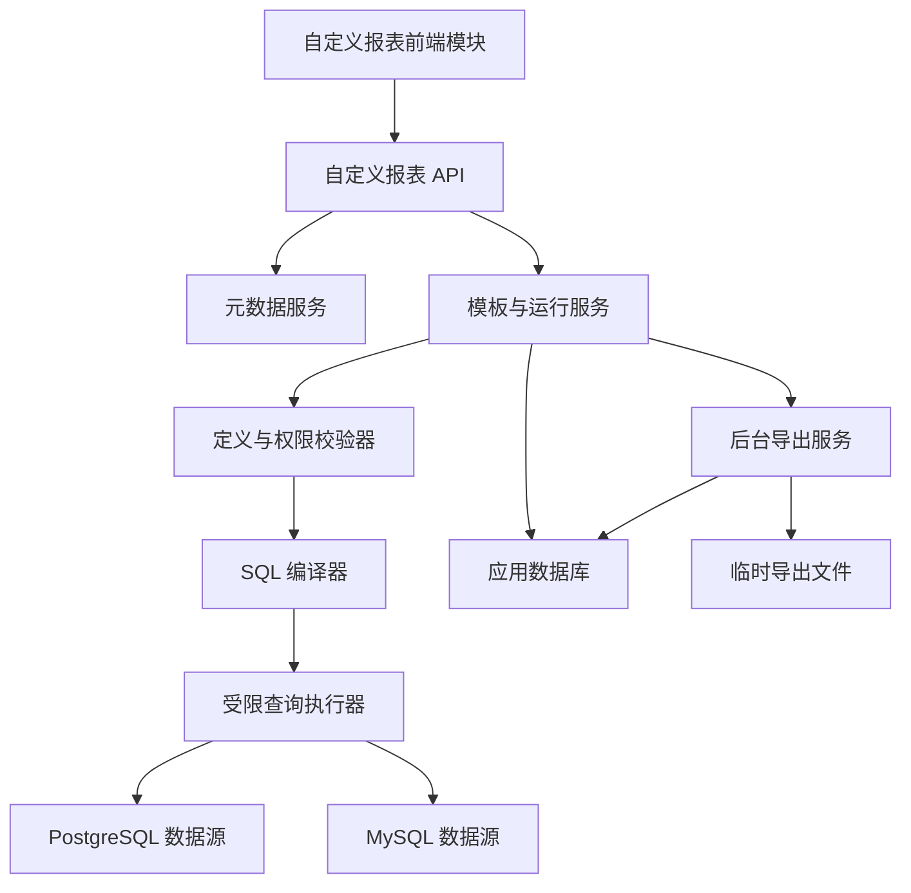
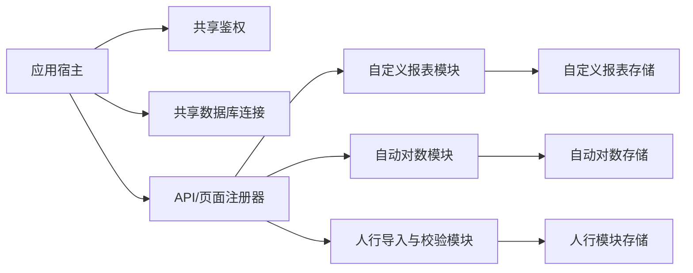

# 自定义报表设计、查看与导出项目实施方案

> **实施约束：** 本文用于立项评审、排期和任务拆分。进入开发后按里程碑逐项实施、测试和验收，不一次性并行铺开全部高级能力。

> **架构前置：** 本项目按独立功能模块实施，开始业务开发前应先完成《新增模块零改动接入实施计划》中定义的模块发现、API/前端资源加载、模块迁移和后台任务宿主。本项目不再把宿主建设计入报表业务代码。

**项目目标：** 在 Auto Check 中建设一个不需要业务用户编写 SQL 的自定义明细报表模块，支持同一数据源内选择一张或多张表、配置关联、选择字段、设置筛选与排序、预览数据、保存模板，并按权限查看和导出。

**总体架构：** 前端保存结构化报表定义，后端完成权限校验、元数据校验和数据库方言 SQL 编译，再通过受限查询执行器完成分页预览或流式导出。模板、版本、执行记录和导出任务存入应用数据库，业务结果不复制到模板中。

**技术栈：** Python 3.12、现有本地 Web 服务、SQLAlchemy 2.x、psycopg、PyMySQL、openpyxl、原生 HTML/CSS/JavaScript、MySQL 应用数据库。

## 1. 立项结论

建议立项，技术可行性为“较高”，但必须按阶段交付。

本项目不是建设完整 BI 平台，而是建设与 Auto Check 数据源、用户体系和操作方式一致的轻量自定义报表能力。首期以“明细查询、模板复用和可靠导出”为核心，不引入图表、仪表盘、跨数据源 JOIN、自由 SQL 和定时报表。

现有系统可以复用：

- PostgreSQL、MySQL 数据源配置和连接能力。
- 表字段读取、数据库标识符引用和只读 SQL 检查。
- 应用数据库及 SQLAlchemy Core 持久化模式。
- 登录、用户角色和接口鉴权。
- 后台任务、状态轮询和文件下载处理方式。
- openpyxl Excel 处理能力。
- 当前亮色活力主题、页面导航和通用组件规范。

需要重点新建：

- 数据库元数据服务。
- 报表定义协议和版本机制。
- 报表定义校验器。
- PostgreSQL/MySQL 安全 SQL 编译器。
- 分页、超时、取消和流式读取能力。
- 多表关联诊断。
- 模板管理、查看、执行历史和后台导出。

## 2. 立项范围

### 2.1 首期必须交付

1. 从现有数据源读取 schema、表、字段、字段注释、类型、主键、唯一索引和外键。
2. 创建单表或多表明细报表。
3. 指定一张主表，增加同一数据源内的关联表。
4. 使用 `LEFT JOIN` 或 `INNER JOIN`，支持多个等值条件并以 `AND` 组合。
5. 选择展示字段，配置字段别名、顺序、格式和是否导出。
6. 配置固定条件、默认条件、运行参数和多字段排序。
7. 预览前 100 行，并展示查询耗时及关联诊断。
8. 保存草稿、发布模板、复制模板、停用模板和查看历史版本。
9. 运行已发布模板并分页查看结果。
10. 导出 CSV、XLSX，较大结果集转入后台任务。
11. 记录模板变更、查询、导出和异常信息。
12. 按角色和模板可见范围控制设计、查看、发布与导出。

首期只允许选择数据源原始字段，不交付计算字段、聚合指标和分组汇总；默认使用线性关联编辑，高级关系图只作为多表关联的辅助视图。

### 2.2 首期明确不做

- 跨不同数据源、不同数据库实例的数据关联。
- 用户提交任意 SQL、SQL 片段或数据库函数。
- `RIGHT JOIN`、`FULL JOIN` 和无条件交叉连接。
- 自动处理多对多重复结果。
- 图表、仪表盘、大屏和透视表。
- 定时运行、邮件订阅和消息推送。
- 报表快照和历史时点数据固化。
- 任意窗口函数、嵌套子查询和复杂计算表达式。
- 将开源 BI 系统直接嵌入 Auto Check。

### 2.3 首期默认容量边界

以下值作为首期默认配置，管理员可以在后续版本中调整：

| 项目 | 默认值 |
|---|---:|
| 单模板最大表数量 | 5 张 |
| 单模板最大展示字段 | 50 个 |
| 单条关联最大字段条件 | 5 个 |
| 预览返回行数 | 100 行 |
| 查看分页大小 | 50 行 |
| 查看查询超时 | 30 秒 |
| 同步导出阈值 | 20,000 行 |
| 单次最大导出量 | 500,000 行 |
| 后台导出并发数 | 2 个 |
| 导出任务超时 | 10 分钟 |
| 导出文件保留时间 | 7 天 |

容量边界不是数据库承载能力承诺。正式上线前应使用用户实际数据量和典型 SQL 做专项压测，再调整默认值。

## 3. 实施路线比较

| 路线 | 内容 | 优点 | 主要问题 | 结论 |
|---|---|---|---|---|
| 直接嵌入 Metabase 等 BI 产品 | 独立部署并通过页面或链接接入 | 功能成熟、见效快 | 用户和权限割裂、部署运维增加、产品体验不一致、许可证边界需要专项评估 | 不采用 |
| 一次性建设完整报表平台 | 同时开发多表、图表、计算、权限、订阅 | 功能覆盖广 | 周期长、风险集中、难以中途验收 | 不采用 |
| 原生轻量模块、分阶段交付 | 先单表闭环，再多表关联，最后模板治理 | 复用现有能力、风险可控、每阶段均可上线验收 | 需要约束首期范围 | 采用 |

交互方式借鉴 Metabase 的逐步查询构建思路：普通模式使用线性步骤配置关联；现有关系图原型保留为高级查看和编辑方式，不作为首期唯一入口。

## 4. 用户和权限模型

### 4.1 角色

| 角色 | 权限 |
|---|---|
| 报表设计人员 | 创建、编辑和复制本人模板，读取授权元数据，预览，保存草稿 |
| 报表查看人员 | 查看授权的已发布模板，输入运行参数，查询和按权限导出 |
| 系统管理员 | 管理全部模板，发布、停用、回退版本，配置可见范围，查看审计记录 |

### 4.2 权限粒度

系统现有管理员/普通用户模型保持不变。报表模块通过自己的 `custom_report_user_permissions` 表附加 `design`、`publish`、`export`、`admin` 能力；系统管理员自动拥有全部能力，普通用户默认仅能查看公开的已发布模板。该方案不要求修改现有用户模块。

首期权限按照以下顺序判断：

1. 用户是否已登录且启用。
2. 用户是否有自定义报表模块权限。
3. 用户是否有目标数据源访问权限。
4. 用户是否有模板查看或编辑权限。
5. 模板是否允许当前用户导出。
6. 字段是否允许展示和导出。

字段级敏感数据脱敏能力纳入数据模型和接口预留；如果现有系统首期没有字段权限配置入口，先由管理员在模板中关闭敏感字段导出，不阻塞基础功能上线。

## 5. 业务流程

### 5.1 设计流程


设计器保持六步：

1. 基本信息。
2. 选择数据表。
3. 配置关联关系。
4. 选择展示字段。
5. 配置筛选与排序。
6. 预览并保存。

### 5.2 查看流程

1. 用户打开已发布模板。
2. 系统校验模板状态、权限和数据源状态。
3. 系统展示运行参数。
4. 用户提交查询。
5. 后端基于固定条件、运行参数和模板版本生成 SQL。
6. 页面分页展示结果、耗时和模板版本。
7. 用户按权限发起 CSV 或 XLSX 导出。

### 5.3 模板生命周期

```text
草稿 -> 已发布 -> 已停用
  |        |
  +--------+-> 复制为新模板
  |
  +-> 删除
```

- 编辑已发布模板时产生新草稿版本，不直接覆盖当前发布版本。
- 发布后，新查询使用新版本；已经开始的查询继续引用启动时的版本。
- 元数据校验失败时，模板显示“配置异常”，但保留历史版本和审计记录。
- 草稿可以删除；已产生运行记录的已发布模板只允许停用，不物理删除。

## 6. 系统架构



### 6.1 元数据服务

职责：

- 列出授权数据源中的 schema、表和视图。
- 获取字段、注释、类型、是否为空、主键、唯一索引和外键。
- 统一 PostgreSQL/MySQL 类型为文本、数值、日期、日期时间、布尔和其他类型族。
- 为关联关系提供外键和同名字段建议。
- 对元数据结果进行短时缓存，默认缓存 5 分钟。

元数据缓存只缓存结构信息，不缓存数据库密码和业务数据。用户手动刷新或模板校验发现结构变化时立即失效。

### 6.2 报表定义模型

模板版本保存结构化 JSON，顶层结构固定为：

```json
{
  "schema_version": 1,
  "source_id": "report-source-id",
  "base_table_node_id": "t1",
  "tables": [],
  "joins": [],
  "columns": [],
  "filters": [],
  "parameters": [],
  "sorts": [],
  "display": {},
  "export": {}
}
```

前端提交表节点 ID、字段 ID、操作符和值，不提交 SQL。`schema_version` 用于未来兼容模板定义升级。

### 6.3 定义校验器

保存、预览、发布和执行前统一调用校验器：

- 数据源存在且用户有权限。
- 表和字段来自实时元数据。
- 主表唯一。
- 所有表均从主表可达。
- 不存在无条件关联。
- 关联字段类型兼容。
- 展示字段、筛选和排序引用有效。
- 参数编码唯一且类型匹配。
- 表、字段和关联数量未超过限制。
- 发布前预览成功。

### 6.4 SQL 编译器

SQL 编译器只接受已经校验的报表定义，分别实现 PostgreSQL 和 MySQL 方言：

- 使用现有 `TableRef` 和数据库标识符引用规则。
- 表别名由后端生成，不接受用户提供的 SQL 别名。
- 查询值全部参数化。
- 预览和分页由后端追加限制。
- 排序字段必须出现在允许排序的字段集合中。
- 最终 SQL 再通过现有只读校验作为第二道防线。
- 前端只能看到查询摘要，不返回完整 SQL 和数据库参数。

### 6.5 查询执行器

现有 `DatabaseClient.fetch_all()` 会把结果全部读入内存，不能直接作为大数据导出的执行方式。本项目新增：

- `fetch_page()`：执行受限分页查询。
- `iter_rows()`：通过服务器游标或分批读取返回结果。
- `cancel()`：取消当前数据库查询或关闭专用连接。
- 查询超时和最大行数保护。
- 返回字段名称、数据库类型、查询耗时和实际行数。

预览、查看和导出使用独立数据库连接，避免取消导出时影响其他业务查询。

### 6.6 导出服务

- 低于同步阈值时直接生成并下载。
- 高于同步阈值时创建持久化后台任务。
- CSV 使用分批读取和流式写入。
- XLSX 使用 openpyxl 只写模式。
- 超过 Excel 单工作表容量时自动拆分工作表。
- 任务完成后生成带有效期的下载地址。
- 服务重启后将执行中的旧任务标记为中断，允许用户重新发起。
- 清理任务删除过期文件并保留审计记录。

## 7. 数据模型

应用数据库 schema 版本从当前版本递增，并新增以下表：

### 7.1 `custom_report_templates`

| 字段 | 用途 |
|---|---|
| `id` | 模板主键 |
| `code` | 唯一稳定编码 |
| `name` | 报表名称 |
| `category` | 报表分类 |
| `description` | 说明 |
| `data_source_id` | 数据源 ID |
| `owner_user_id` | 所有者 |
| `visibility_scope` | 可见范围 |
| `allow_export` | 是否允许导出 |
| `status` | draft、published、disabled、invalid |
| `current_version` | 当前编辑版本 |
| `published_version` | 当前发布版本 |
| `created_at`、`updated_at` | 审计时间 |

### 7.2 `custom_report_template_versions`

| 字段 | 用途 |
|---|---|
| `id` | 版本主键 |
| `template_id` | 模板 ID |
| `version` | 递增版本号 |
| `definition_json` | 完整结构化定义 |
| `definition_fingerprint` | 定义摘要 |
| `metadata_fingerprint` | 发布时元数据摘要 |
| `change_summary` | 变更摘要 |
| `created_by`、`created_at` | 创建审计 |
| `published_by`、`published_at` | 发布审计 |

### 7.3 `custom_report_runs`

记录 preview、view 和 export 三类执行，包括模板版本、脱敏参数、状态、行数、耗时、查询指纹、操作者和错误摘要。

### 7.4 `custom_report_export_jobs`

记录格式、状态、进度、文件名、文件路径、过期时间和错误摘要。文件路径仅允许指向系统指定的自定义报表导出目录。

### 7.5 `custom_report_user_permissions`

记录用户在报表模块内的 `can_design`、`can_publish`、`can_export`、`can_admin` 能力、允许访问的数据源 ID 白名单及更新审计。首期模板可见范围只支持 `private` 和 `all`，更细的组织、用户组和逐模板授权进入后续增强。

### 7.6 数据一致性约束

- 模板编码唯一。
- 同一模板内版本号唯一。
- 发布版本必须属于当前模板。
- 执行记录必须引用明确的模板版本。
- 模板和执行历史采用逻辑状态管理，不级联删除审计数据。

## 8. API 清单

### 8.1 元数据

| 方法 | 路径 | 用途 |
|---|---|---|
| GET | `/api/modules/custom-reports/metadata/schemas` | 获取 schema |
| GET | `/api/modules/custom-reports/metadata/tables` | 获取表和视图 |
| GET | `/api/modules/custom-reports/metadata/tables/{table_id}/columns` | 获取字段和约束 |
| POST | `/api/modules/custom-reports/metadata/refresh` | 刷新元数据缓存 |
| POST | `/api/modules/custom-reports/metadata/validate` | 校验模板引用 |

### 8.2 模板

| 方法 | 路径 | 用途 |
|---|---|---|
| GET | `/api/modules/custom-reports/templates` | 分页查询模板 |
| POST | `/api/modules/custom-reports/templates` | 创建模板 |
| GET | `/api/modules/custom-reports/templates/{id}` | 获取模板 |
| PUT | `/api/modules/custom-reports/templates/{id}` | 保存草稿版本 |
| DELETE | `/api/modules/custom-reports/templates/{id}` | 删除未发布草稿 |
| POST | `/api/modules/custom-reports/templates/{id}/copy` | 复制模板 |
| POST | `/api/modules/custom-reports/templates/{id}/publish` | 发布版本 |
| POST | `/api/modules/custom-reports/templates/{id}/disable` | 停用模板 |
| POST | `/api/modules/custom-reports/templates/{id}/rollback` | 回退发布版本 |

### 8.3 查询和导出

| 方法 | 路径 | 用途 |
|---|---|---|
| POST | `/api/modules/custom-reports/query/validate` | 校验未保存定义 |
| POST | `/api/modules/custom-reports/query/preview` | 预览未保存定义 |
| POST | `/api/modules/custom-reports/templates/{id}/run` | 运行已发布模板 |
| POST | `/api/modules/custom-reports/runs/{id}/cancel` | 取消查询 |
| POST | `/api/modules/custom-reports/templates/{id}/exports` | 创建导出 |
| GET | `/api/modules/custom-reports/exports/{id}` | 查询导出状态 |
| GET | `/api/modules/custom-reports/exports/{id}/download` | 下载导出文件 |
| GET | `/api/modules/custom-reports/history` | 查询执行历史 |

所有修改类接口继续使用现有会话鉴权和 CSRF 防护方式；服务端不信任前端传入的角色、所有者和可见范围判断结果。

## 9. 前端方案

### 9.1 文件边界

现有 `index.html`、`app.js` 和 `styles.css` 已经是多人开发时的高冲突文件。本项目不在这些公共文件中增加报表业务代码，所有前端资源均放入模块目录：

- `src/auto_check/modules/custom_reports/web/index.js`：模块注册和生命周期。
- `src/auto_check/modules/custom_reports/web/api.js`：模块内 API 客户端。
- `src/auto_check/modules/custom_reports/web/store.js`：模块状态。
- `src/auto_check/modules/custom_reports/web/pages/`：模板列表、设计器、查看和执行记录。
- `src/auto_check/modules/custom_reports/web/components/`：关联编辑、字段配置、筛选器和结果表格。
- `src/auto_check/modules/custom_reports/web/styles.css`：只作用于自定义报表模块的样式。

模块宿主根据 `manifest.json` 自动发现导航、脚本和样式，浏览器继续使用原生 ES Module；报表模块不得直接修改 `src/auto_check/web/index.html`、`app.js`、`styles.css` 或 `src/auto_check/app/server.py`。模块打包收集规则属于宿主前置能力，不在本项目内重复实现。

### 9.2 页面

1. 模板列表：我的报表、已发布报表、状态、版本和操作。
2. 六步设计器：普通模式默认使用线性关联配置。
3. 高级关系视图：展示关系图，并允许选择节点进入关联编辑。
4. 报表查看：参数区、条件摘要、结果表格、分页和导出。
5. 执行记录：查询状态、耗时、行数、错误和导出下载。

### 9.3 UI 约束

- 只使用当前亮色活力主题。
- 主操作按钮使用固定 Logo 蓝渐变 `#3466D9` 到 `#6AA4FF`。
- 其他控件复用全局主题色和圆角变量。
- 删除、停用使用危险色，关联膨胀使用警告色。
- 不引入暗色模式、主题切换或另一套组件风格。
- 警告信息必须包含图标和文字，不能只用颜色表达。

## 10. 模块化和多人并行开发方案

### 10.1 前置条件

自定义报表必须运行在已验收的标准模块宿主上。宿主负责模块自动发现、统一鉴权、API 前缀、前端资源加载、模块独立迁移、后台任务和打包收集；具体要求见：

- `docs/superpowers/specs/2026-07-31-modular-extension-architecture-design.md`
- `docs/superpowers/plans/2026-07-31-modular-extension-host-implementation.md`

本项目只实现自定义报表模块，不修改既有业务模块，也不在公共入口中添加报表专用分支。模块之间仍共享登录会话、应用数据库连接、公共主题和宿主协议，因此目标是业务代码自治和稳定契约隔离，而不是进程级或数据库实例级的绝对隔离。

### 10.2 推荐方式：功能包自治

每个功能模块拥有自己的：

- API 路由处理。
- 业务服务。
- 数据模型和持久化。
- 后台任务。
- 前端页面、状态、组件和样式。
- 单元测试、接口测试和前端静态测试。
- 模块说明文档。

模块只通过明确接口使用共享能力，不直接读取其他模块内部状态。



### 10.3 后端隔离边界

新增 `src/auto_check/modules/custom_reports/` 标准模块包，通过 `manifest.json` 和 `module.py` 向宿主声明：

- 模块编码、版本、导航、权限和前端资源。
- `/api/modules/custom-reports/*` 下的相对 API 路由。
- `migrations/` 中的模块独立迁移。
- 启停生命周期和后台导出任务恢复入口。

模块通过 `ModuleContext` 获取当前用户、数据源配置、应用数据库、临时目录、日志、时钟和后台任务执行器，不反向导入 `ApiRouter`、`server.py` 或其他业务模块。模块内部可以继续按 `contracts`、`storage`、`service`、`api` 分层，但这些类型均不作为跨模块公共接口。

### 10.4 前端隔离边界

自定义报表前端使用模块宿主提供的 `window.AutoCheckModuleHost` 接口完成挂载、卸载、请求、消息和会话读取。模块只能在宿主分配的根节点内查询 DOM，样式统一以 `.custom-report-module` 为顶层作用域；不得直接修改其他页面元素，也不得定义无作用域的通用按钮、输入框和表格选择器。

导航和资源由清单自动注册，新增页面、组件和样式只修改 `src/auto_check/modules/custom_reports/web/`。现有页面继续运行，是否迁移旧模块不属于本项目范围。

### 10.5 应用数据库隔离边界

报表表结构通过 `src/auto_check/modules/custom_reports/migrations/001_initial.sql` 等模块迁移维护。宿主按模块编码和模块内版本记录执行状态；报表开发不修改全局 `EXPECTED_APP_SCHEMA` 和全局 schema 版本。迁移只能操作 `custom_report_*` 表，失败时必须阻止该模块启用并保留清晰诊断。

### 10.6 共享基础设施清单

只有以下内容允许作为跨模块共享能力：

- 登录会话、用户和角色。
- 数据源配置、密码解密和连接创建。
- 应用数据库引擎和事务入口。
- API 响应、错误脱敏和 CSRF 校验。
- 页面导航、主题变量、消息提示和确认弹窗。
- 后台任务通用状态协议。
- 时间、日志和临时文件目录。

共享层不得依赖任何具体业务模块。某个模块需要的新通用能力，先以最小接口加入共享层，再由其他模块按需使用。

### 10.7 多人协作规则

| 区域 | 责任方式 |
|---|---|
| `src/auto_check/modules/custom_reports/` | 报表模块团队负责 |
| `src/auto_check/modules/custom_reports/web/` | 报表前端开发人员负责 |
| `tests/modules/custom_reports/` | 对应模块开发和测试共同负责 |
| `src/auto_check/modules/custom_reports/migrations/` | 报表模块团队独立编号和维护 |
| `server.py`、`index.html`、`app.js`、`styles.css` | 报表模块禁止修改 |
| 公共主题和鉴权 | 单独评审，必须运行全量回归 |

每个模块合并前先通过模块测试，再由集成分支运行全量测试。模块之间通过接口契约协作，不依赖未合并分支中的内部函数。

### 10.8 模块化演进顺序

1. 先按独立计划完成并验收模块宿主。
2. 自定义报表从第一行正式代码开始使用标准模块结构。
3. M0 只验证报表特有的元数据、SQL、取消和流式导出能力。
4. 每个业务里程碑先通过模块测试，再运行全量回归。
5. 旧功能是否迁移由后续项目决定，不阻塞自定义报表交付。

## 11. 后端文件规划

| 文件 | 责任 |
|---|---|
| `src/auto_check/modules/custom_reports/manifest.json` | 模块元数据、导航、权限、API 和前端资源声明 |
| `src/auto_check/modules/custom_reports/module.py` | 生命周期、路由和后台任务注册 |
| `src/auto_check/modules/custom_reports/contracts.py` | 报表定义对象、枚举和序列化 |
| `src/auto_check/modules/custom_reports/metadata.py` | PostgreSQL/MySQL 元数据读取与缓存 |
| `src/auto_check/modules/custom_reports/validator.py` | 结构、权限、类型和关联图校验 |
| `src/auto_check/modules/custom_reports/sql_compiler.py` | 参数化 SQL 编译和分页 SQL |
| `src/auto_check/modules/custom_reports/executor.py` | 独立连接、分页、流式读取、超时和取消 |
| `src/auto_check/modules/custom_reports/service.py` | 模板、版本、发布和运行编排 |
| `src/auto_check/modules/custom_reports/export_jobs.py` | CSV/XLSX 导出和后台任务 |
| `src/auto_check/modules/custom_reports/storage.py` | 模块表和持久化 |
| `src/auto_check/modules/custom_reports/api.py` | 模块相对路由和 HTTP 数据转换 |
| `src/auto_check/modules/custom_reports/migrations/` | 模块独立数据库迁移 |
| `src/auto_check/modules/custom_reports/web/` | 模板列表、设计器、查看、历史和模块样式 |
| `tests/modules/custom_reports/` | 单元、接口、静态结构和集成测试 |

报表查询执行器在模块内部实现稳定的 PostgreSQL/MySQL 连接适配，不调用现有 `DatabaseClient._connect` 等私有方法；只有形成跨模块复用需求时，才另行评审公共能力扩展。

## 12. 交付里程碑

### M0：技术验证

**目标：** 在 PostgreSQL 和 MySQL 上验证元数据、SQL 编译、分页和流式导出路线。

**进入条件：** 标准模块宿主已通过其独立实施计划的全部验收，空白示例模块可以零改动接入、迁移、加载、鉴权和打包。

**交付物：**

- 标准自定义报表空模块和模块清单。
- 两种数据库的表、字段、主键、唯一索引和外键读取样例。
- 单表、LEFT JOIN、INNER JOIN 参数化 SQL 验证。
- 10 万行 CSV/XLSX 分批导出验证。
- 查询超时和取消能力验证报告。

**出口标准：**

- 前端无需提交 SQL。
- 两种数据库生成结果一致。
- 导出过程内存保持有界。
- 至少有一种可靠的数据库查询取消方式。
- 自定义报表模块可以独立加载、独立测试并随应用正常打包。

未通过 M0 不进入完整界面开发。

### M1：单表闭环

**目标：** 交付可上线使用的单表自定义报表。

**交付物：**

- 元数据接口。
- 单表六步设计流程。
- 字段、筛选、参数和排序。
- 预览、保存草稿和模板查看。
- CSV/XLSX 导出。
- 模板、版本和执行记录基础表。

**出口标准：**

- 用户可以独立完成单表报表设计、保存、查看和导出。
- 所有筛选值参数化。
- 预览、分页和导出均受容量限制。

### M2：多表关联

**目标：** 完成原始需求中的同源多表拼接。

**交付物：**

- 主表、关联表和线性关联编辑器。
- LEFT JOIN、INNER JOIN 和多字段等值关联。
- 外键关系推荐。
- 关联图连通性、类型兼容性和多对多检查。
- 结果膨胀、未匹配和重复匹配诊断。
- 高级关系图视图。

**出口标准：**

- 每张关联表均有有效路径连接主表。
- 无条件笛卡尔积无法保存或执行。
- 多对多关系未经管理员确认不能发布。
- 典型两表、三表和五表模板通过验收。

### M3：模板治理和生产化

**目标：** 满足正式生产使用所需的权限、版本和可靠性要求。

**交付物：**

- 发布、停用、复制和版本回退。
- 模板可见范围和导出权限。
- 配置异常检测。
- 持久化后台导出任务。
- 执行与导出历史。
- 超时、取消、并发和文件清理。
- 用户操作提示和错误脱敏。

**出口标准：**

- 发布版本可追溯和回退。
- 服务重启不会产生永久“执行中”任务。
- 数据源结构变化能够定位到失效表或字段。
- 数据库密码、连接串和原始敏感参数不进入错误响应。

### M4：联调、试运行和上线

**目标：** 完成真实数据验证和正式交付。

**交付物：**

- 真实业务样本模板。
- PostgreSQL/MySQL 兼容性报告。
- 性能和大数据导出报告。
- 用户操作说明。
- 上线、回滚和问题响应清单。

**出口标准：**

- 全量自动化测试通过。
- 核心业务回归通过。
- 用户验收场景全部通过。
- 无高风险安全和性能问题。

## 13. 工作量和排期基线

以下为净开发工作量估算，不包含需求长时间等待、外部数据源协调和生产审批：

| 里程碑 | 估算人日 |
|---|---:|
| 模块宿主前置项目 | 5～8（单独立项，不计入下方合计） |
| M0 报表技术验证 | 4～6 |
| M1 单表闭环 | 12～15 |
| M2 多表关联 | 14～18 |
| M3 模板治理和生产化 | 12～16 |
| M4 联调、试运行和上线 | 7～10 |
| 自定义报表模块合计 | 49～65 |

建议配置：

- 后端开发 1 人。
- 前端开发 1 人。
- 测试 0.5～1 人。
- 产品或业务负责人 0.5 人。
- 数据库管理员按需参与 M0、M2 和性能测试。

标准模块宿主验收后，按上述配置，自定义报表模块日历周期建议按 6～8 周规划；如果由一名全栈开发人员承担主要开发，建议按 9～12 周规划。若从宿主建设同步起算，整体建议预留 7～9 周。里程碑之间设置评审门，不以压缩测试换取表面进度。

## 14. 测试方案

### 14.1 单元测试

- 报表定义序列化和版本兼容。
- 表和字段白名单校验。
- 关联图连通性、循环和孤立节点。
- 字段类型族兼容。
- PostgreSQL/MySQL 标识符引用。
- 所有筛选操作符的参数化 SQL。
- 分页、排序和行数限制。
- 模板状态和版本转换。
- CSV/XLSX 格式和数据类型。

### 14.2 集成测试

- PostgreSQL 和 MySQL 元数据读取。
- 单表、两表、三表和五表关联查询。
- 数据库字段删除、改名和类型变化。
- 查询超时和取消。
- 大数据量流式读取和后台导出。
- 服务重启后的导出任务恢复处理。
- 用户权限、模板可见范围和导出权限。

### 14.3 前端静态与交互测试

- 六步页面结构和步骤切换。
- 主表唯一。
- 关联表必须配置关联。
- 删除表同步清理字段、条件和排序引用。
- 筛选参数校验。
- 预览、保存、发布和错误提示。
- 分页、列显示和导出任务状态。
- 当前亮色主题、圆角和语义色规范。

### 14.4 回归测试

每个里程碑完成后运行：

```text
python -m pytest -q
git diff --check
```

重点回归自动对数、人行全量产品导入、人行逐笔校验、流程工具、核对历史和现有导出功能。普通源码和前端交付不自动刷新 `dist\auto-check.exe`；只有明确要求交付打包程序时再执行 Windows 打包。

## 15. 验收用例

| 编号 | 验收场景 | 通过条件 |
|---|---|---|
| CR-01 | 创建单表报表 | 可选择字段、设置条件、预览、保存和查看 |
| CR-02 | 创建两表左连接报表 | 主表无匹配数据仍保留，字段结果正确 |
| CR-03 | 创建三表多字段关联报表 | 多个等值条件正确组合，所有表与主表连通 |
| CR-04 | 配置无关联表 | 系统阻止保存并定位孤立表 |
| CR-05 | 关联字段类型不兼容 | 系统阻止执行并说明字段 |
| CR-06 | 多对多结果膨胀 | 页面显示增长倍数和警告，未经确认不能发布 |
| CR-07 | 运行参数查询 | 必填、类型和操作符校验正确，值使用参数绑定 |
| CR-08 | 发布后修改 | 生成新草稿版本，不影响当前发布版本 |
| CR-09 | 数据源字段被删除 | 模板标记配置异常并定位所有受影响引用 |
| CR-10 | 小结果导出 | 同步生成 CSV/XLSX，表头和类型正确 |
| CR-11 | 大结果导出 | 后台执行、可查询进度、内存有界、文件可下载 |
| CR-12 | 越权访问 | 无权限用户不能查看、运行、编辑或导出 |
| CR-13 | 查询超时与取消 | 数据库查询被终止，任务状态和错误信息正确 |
| CR-14 | 数据库异常 | 响应不包含密码、完整连接串或驱动堆栈 |
| CR-15 | 现有功能回归 | 仓库全量自动化测试通过且核心功能无回归 |
| CR-16 | 模块独立性 | 报表模块测试可单独运行，禁用模块后其他页面和接口正常 |
| CR-17 | 多人并行改动 | 前后端报表开发不需要同时修改 `app.js`、`styles.css` 和 `server.py` 业务区 |

## 16. 上线策略

### 16.1 灰度顺序

1. 开发环境完成 M0 验证。
2. 测试环境开放给管理员和指定报表设计人员。
3. 选择 3～5 个真实报表模板试运行。
4. 开放已发布模板给指定查看用户。
5. 观察查询耗时、失败率、导出量和数据库负载。
6. 达到稳定标准后开放给全部授权用户。

### 16.2 上线开关

新增系统级功能开关。关闭时隐藏导航入口并拒绝新的设计和查询请求，但保留模板、版本和历史数据。

### 16.3 回滚

- 应用版本回滚前停止新的导出任务。
- 将执行中的任务标记为中断。
- 回滚前备份新增应用数据库表。
- 不自动删除新表和历史数据。
- 旧版本不识别新 schema 时，按数据库备份和应用版本成对恢复。

## 17. 风险清单

| 风险 | 等级 | 控制措施 |
|---|---|---|
| 任意 SQL 或注入 | 高 | 结构化定义、元数据白名单、参数化值、只读账号、最终只读校验 |
| 多表关联导致数据膨胀 | 高 | 主表驱动、关系推荐、基数声明、抽样诊断、发布门禁 |
| 大导出占满内存 | 高 | 分批读取、流式 CSV、XLSX 只写模式、行数和并发限制 |
| 查询取消只有界面状态变化 | 高 | M0 验证数据库级取消，不通过不进入完整开发 |
| 公共前端文件继续膨胀 | 中 | 自定义报表 JS/CSS 独立，公共文件只保留注册入口 |
| 模块化改造范围失控 | 高 | 只建立最小宿主和注册机制，不在报表项目前重写所有旧模块 |
| 多分支同时修改共享 schema 版本 | 中 | 模块声明独立，版本编号和迁移顺序由集成人员统一管理 |
| 数据源结构变化使模板失效 | 中 | 运行前校验、元数据指纹、配置异常状态和明确定位 |
| MySQL/PostgreSQL行为不一致 | 中 | 独立方言编译器、同场景双数据库集成测试 |
| 权限模型一次建设过重 | 中 | 首期复用角色与模板可见范围，字段治理能力分层落地 |
| 开源许可证影响闭源交付 | 低 | 只参考产品交互，不复制 AGPL/GPL 源码 |

## 18. 项目管理和决策机制

### 18.1 里程碑评审

每个里程碑评审以下内容：

- 功能演示。
- 测试结果。
- 性能和安全风险。
- 未完成项是否影响出口标准。
- 下一里程碑范围是否需要调整。

只有出口标准通过后才进入下一里程碑。

### 18.2 变更控制

以下需求自动进入后续增强池，不插入首期：

- 跨数据源关联。
- 图表和仪表盘。
- 定时报表和订阅。
- 自由 SQL。
- 复杂计算字段。
- 数据快照。

如果必须加入首期，应重新评估人日、风险和上线日期，并单独形成范围变更记录。

## 19. 立项通过条件

建议满足以下条件后批准进入 M0：

1. 标准模块宿主已经完成并通过验收。
2. 确认首期范围和非目标。
3. 指定业务负责人和验收人。
4. 提供至少一个 PostgreSQL、一个 MySQL 测试数据源。
5. 提供 3～5 个具有代表性的真实报表样例。
6. 测试数据源账号具备只读权限。
7. 接受宿主完成后 6～8 周双开发人员排期基线，或接受单开发人员更长周期。
8. 接受 M0 技术验证为继续投资门槛。

## 20. 正式交付物

- 经确认的功能设计文档。
- 本项目实施方案。
- 自定义报表交互原型。
- 数据库 schema 变更。
- 后端服务、接口和前端页面。
- 自动化测试和测试结果。
- PostgreSQL/MySQL 兼容性验证记录。
- 性能及大数据导出验证记录。
- 用户操作说明和上线回滚说明。
- 模块开发约定和模块接入示例。

## 21. 立项建议

批准项目进入 M0 技术验证，并锁定以下原则：

- 首期只做同一数据源内的明细报表。
- 首期必须交付多表关联，但在单表闭环稳定后实施。
- 前端不接受任意 SQL，后端统一编译参数化 SQL。
- 大数据导出必须有界内存、可超时、可取消。
- 先采用线性关联编辑器，关系图作为高级模式。
- M0 未验证数据库级取消和流式导出前，不承诺生产上线日期。
- 自定义报表采用标准独立模块目录，API、前端资源、迁移和后台任务均由清单自动注册。
- 自定义报表业务开发不得修改 `server.py`、`index.html`、`app.js`、`styles.css` 和现有业务模块。
- 模块宿主作为独立前置项目验收，不与报表业务代码混合交付。

本方案对应的详细功能设计为 `docs/superpowers/specs/2026-07-31-custom-report-designer-design.md`，交互参考为 `docs/prototypes/custom-report-designer-preview.html`。
