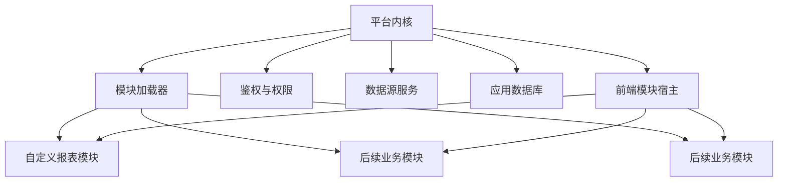

# Auto Check 模块化扩展架构方案

状态：独立方案，待立项评审

日期：2026-07-31

首个试点模块：自定义报表设计、查看与导出

## 1. 背景

Auto Check 当前已经形成自动对数、人行产品导入、人行逐笔校验、流程工具、核对历史、报送导航、系统设置和用户管理等功能。后端虽然存在配置、存储和业务服务文件，但公共入口仍比较集中：

- `src/auto_check/app/server.py` 约 3,686 行，集中处理 API 分发、后台任务和部分业务逻辑。
- `src/auto_check/app/app_database.py` 集中维护应用数据库表结构和全局 schema 版本。
- `src/auto_check/web/index.html` 约 1,660 行，集中维护页面容器和导航。
- `src/auto_check/web/app.js` 约 10,922 行，集中维护多个页面的状态和交互。
- `src/auto_check/web/styles.css` 约 13,806 行，集中维护全部样式。

如果多人直接在这些公共文件中增加功能，会频繁产生合并冲突，也容易使一个模块的样式、状态或异常影响其他模块。

本方案建设一次性的模块宿主和扩展协议。完成宿主改造后，新增业务功能原则上只需要增加一个模块目录，不需要修改现有业务模块代码，也不需要继续向 `server.py`、`app.js` 和 `styles.css` 堆叠业务实现。

## 2. 目标

- 支持通过新增独立目录接入新功能模块。
- 模块拥有独立后端、前端、数据表、迁移、权限和测试。
- 后端 API、前端导航和页面资源能够自动注册。
- 模块不直接依赖其他业务模块内部实现。
- 单个可选模块加载失败时，不影响核心系统和其他模块启动。
- 多名开发人员可以分别维护不同模块，降低公共文件冲突。
- 模块可以单独测试、评审、启用、停用和排查问题。
- 保持现有 Python、本地 Web、原生前端和 PyInstaller 技术栈。
- 允许现有功能逐步迁移，不要求一次性重写。

## 3. 非目标

本方案不包含：

- 在宿主改造前完全不修改任何现有公共文件。
- 把模块运行在真正的操作系统安全沙箱中。
- 允许用户上传和运行不受信任的第三方 Python 代码。
- 将当前应用重写为 React、Vue、微服务或独立前后端工程。
- 一次性拆分全部现有业务功能。
- 为每个模块建立独立进程或独立数据库实例。
- 保证模块运行时绝对互不影响。

模块仍共享应用进程、数据库连接池、磁盘、内存和网络资源。代码边界和故障处理可以降低影响，但无法替代进程级资源隔离。

## 4. 核心结论

采用“平台内核＋自动发现模块＋渐进迁移”方案。

系统分为：

1. 平台内核：登录会话、用户、数据源、应用数据库、HTTP、模块加载、权限、公共前端宿主和打包能力。
2. 业务模块：各自拥有业务服务、API、页面、样式、数据库迁移和测试。
3. 遗留功能：现有功能暂时保持原状，后续按业务优先级逐个迁入模块目录。



宿主改造完成后，新增模块允许修改：

- `src/auto_check/modules/<module_id>/`
- `tests/modules/<module_id>/`
- 该模块自己的设计和使用文档

新增普通模块原则上不再修改：

- 现有业务模块代码
- `src/auto_check/app/server.py`
- `src/auto_check/web/app.js`
- `src/auto_check/web/styles.css`
- `src/auto_check/web/index.html`
- 全局数据库版本常量

平台协议需要扩展时，可以修改平台内核，但必须作为独立架构变更评审，不能混入普通业务模块开发。

## 5. 总体目录结构

建议新增：

```text
src/auto_check/
├── app/
│   └── module_system/
│       ├── __init__.py
│       ├── contracts.py
│       ├── discovery.py
│       ├── registry.py
│       ├── routing.py
│       ├── schema.py
│       ├── permissions.py
│       ├── resources.py
│       └── runtime.py
├── modules/
│   ├── __init__.py
│   └── custom_reports/
│       ├── __init__.py
│       ├── manifest.json
│       ├── module.py
│       ├── api.py
│       ├── contracts.py
│       ├── service.py
│       ├── storage.py
│       ├── metadata.py
│       ├── validator.py
│       ├── sql_compiler.py
│       ├── executor.py
│       ├── export_jobs.py
│       ├── migrations/
│       │   ├── 001_initial.sql
│       │   └── 002_export_jobs.sql
│       └── web/
│           ├── index.js
│           ├── api.js
│           ├── store.js
│           ├── styles.css
│           ├── pages/
│           └── components/
└── web/
    └── module_host.js

tests/
├── module_system/
└── modules/
    └── custom_reports/
```

`module_system` 是共享平台能力，只负责模块加载和运行协议，不包含任何报表、对数或校验业务规则。

`modules/<module_id>` 是业务模块的唯一实现边界。模块目录内部可以继续按职责拆分，但不得反向修改其他模块。

## 6. 模块清单协议

每个模块必须提供 `manifest.json`。

建议格式：

```json
{
  "id": "custom_reports",
  "name": "自定义报表",
  "version": "1.0.0",
  "platform_api": 1,
  "required": false,
  "backend_entry": "auto_check.modules.custom_reports.module:create_module",
  "api_prefix": "/api/modules/custom-reports",
  "frontend_entry": "/module-assets/custom_reports/index.js",
  "frontend_style": "/module-assets/custom_reports/styles.css",
  "navigation": [
    {
      "id": "custom-reports",
      "label": "自定义报表",
      "route": "custom-reports",
      "order": 60,
      "permission": "custom_reports.view"
    }
  ],
  "permissions": [
    "custom_reports.view",
    "custom_reports.design",
    "custom_reports.publish",
    "custom_reports.export",
    "custom_reports.admin"
  ],
  "dependencies": [],
  "schema_version": 2
}
```

### 6.1 字段约束

| 字段 | 规则 |
|---|---|
| `id` | 全局唯一，只允许小写字母、数字和下划线 |
| `name` | 用户可见模块名称 |
| `version` | 模块功能版本，使用语义化版本 |
| `platform_api` | 模块需要的平台接口版本 |
| `required` | 是否为系统启动必需模块 |
| `backend_entry` | 后端模块工厂入口 |
| `api_prefix` | 模块独占 API 前缀 |
| `frontend_entry` | 前端 ES Module 入口 |
| `frontend_style` | 模块作用域样式 |
| `navigation` | 模块导航声明 |
| `permissions` | 模块权限编码 |
| `dependencies` | 其他公开模块依赖 |
| `schema_version` | 模块数据库结构版本 |

### 6.2 命名空间

- 模块 ID：`custom_reports`
- API：`/api/modules/custom-reports/*`
- 权限：`custom_reports.*`
- 数据库表：`custom_report_*`
- 前端路由：`custom-reports`
- 前端根节点：`data-module="custom_reports"`
- 事件：`custom_reports:<event-name>`

模块加载器发现重复的模块 ID、API 前缀、路由或权限编码时，阻止冲突模块加载并记录明确错误。

## 7. 后端模块接口

模块入口实现统一协议：

```python
class AutoCheckModule:
    manifest: ModuleManifest

    def register_routes(self, router: ModuleRouter) -> None: ...

    def register_schema(self, registry: ModuleSchemaRegistry) -> None: ...

    def start(self, context: ModuleContext) -> None: ...

    def stop(self) -> None: ...

    def health(self) -> ModuleHealth: ...
```

### 7.1 `ModuleContext`

平台通过 `ModuleContext` 提供受控共享能力：

- 当前配置存储访问器。
- 数据源解析器。
- 数据库客户端工厂。
- 应用数据库事务入口。
- 当前时间服务。
- 模块专属日志器。
- 模块专属临时目录。
- 后台任务执行器。
- 权限检查器。
- 公共事件总线。

模块不得直接持有或修改平台内核的可变全局对象。

### 7.2 路由注册

模块只能注册相对路径：

```text
GET  /templates
POST /templates
POST /templates/{id}/run
```

平台自动拼接清单中的 API 前缀：

```text
/api/modules/custom-reports/templates
/api/modules/custom-reports/templates/{id}/run
```

这样可以避免模块之间争抢全局路径。

每个路由声明：

- HTTP 方法。
- 相对路径。
- 所需权限。
- 请求体大小上限。
- 是否允许匿名访问。
- 是否为文件下载。
- 处理函数。

默认规则为必须登录、启用 CSRF 防护、限制请求体大小并执行统一错误脱敏。模块只能主动收紧规则，不能关闭平台基础安全检查。

## 8. 模块发现和启动

### 8.1 发现过程

1. 平台扫描 `auto_check.modules` 下的直接子包。
2. 读取每个子包的 `manifest.json`。
3. 校验模块 ID、版本、平台接口版本和资源路径。
4. 检查模块依赖和循环依赖。
5. 按依赖顺序加载后端入口。
6. 注册权限、数据库结构和 API。
7. 执行模块数据库迁移。
8. 调用模块 `start()`。
9. 将成功加载的模块暴露给前端。

模块按模块 ID 排序，保证没有依赖关系时加载顺序稳定。

### 8.2 必需模块和可选模块

- `required=true`：加载失败时阻止应用启动，适用于未来真正的核心平台模块。
- `required=false`：加载失败时禁用当前模块，其他模块和现有功能继续启动。

新增业务模块默认必须是可选模块。

### 8.3 启停状态

模块状态统一为：

- `discovered`
- `loading`
- `enabled`
- `disabled`
- `incompatible`
- `migration_failed`
- `startup_failed`

应用数据库保存管理员启停状态。停用模块时：

- 不注册导航。
- 拒绝模块 API。
- 不启动模块后台任务。
- 保留模块数据表和历史数据。
- 不自动删除模块导出文件以外的数据。

## 9. 前端模块宿主

### 9.1 加载过程

1. 页面完成登录状态检查。
2. 请求 `GET /api/system/modules`。
3. 获取当前用户可见的模块清单和资源版本。
4. 加载模块样式。
5. 使用浏览器原生 `import()` 加载模块入口。
6. 调用模块 `mount()`。
7. 根据模块导航声明生成菜单。
8. 路由进入模块时调用 `activate()`。

不引入 Node.js 构建链，也不要求将现有前端整体迁移为 ES Module。

### 9.2 前端生命周期

每个模块入口导出：

```javascript
export function mount(context) {}
export function activate(route) {}
export function deactivate() {}
export function unmount() {}
```

含义：

- `mount()`：创建模块根节点和只需要初始化一次的监听器。
- `activate()`：进入模块页面，加载当前页面数据。
- `deactivate()`：离开模块页面，停止轮询和可取消任务。
- `unmount()`：模块停用或会话切换时彻底清理。

### 9.3 `FrontendModuleContext`

宿主向模块提供：

- 模块根节点。
- 当前用户的只读信息。
- 带鉴权和 CSRF 的请求方法。
- 消息提示、确认框和加载状态。
- 模块内部路由方法。
- 主题变化订阅。
- 会话失效订阅。
- 命名空间事件发布和订阅。

模块不得依赖 `app.js` 中未声明为平台接口的变量和函数。

### 9.4 DOM 和样式隔离

- 模块只能在自己的根节点中查询和修改 DOM。
- 模块元素 ID 使用模块前缀，或只使用根节点内选择器。
- 样式必须以 `.auto-check-module[data-module="custom_reports"]` 为顶层作用域。
- 禁止定义无作用域的 `button`、`input`、`table`、`.card` 等选择器。
- 模块复用平台 CSS 变量，不复制或覆盖全局主题。
- 模块卸载时移除监听器、定时器、轮询和临时 DOM。

当前浏览器环境不提供真正的 Shadow DOM 隔离。采用作用域选择器和自动静态测试控制样式影响范围。

## 10. 应用数据库和模块迁移

### 10.1 问题

当前应用数据库使用全局 schema 版本和集中表结构声明。如果不同开发分支同时增加数据表，容易争抢同一个版本号并产生合并冲突。

### 10.2 模块版本表

新增：

`app_modules`

| 字段 | 用途 |
|---|---|
| `module_id` | 模块 ID |
| `module_version` | 当前模块功能版本 |
| `enabled` | 是否启用 |
| `status` | 当前状态 |
| `last_error` | 最近启动或迁移错误摘要 |
| `installed_at` | 首次发现时间 |
| `updated_at` | 最近更新时间 |

`app_module_schema_versions`

| 字段 | 用途 |
|---|---|
| `module_id` | 模块 ID |
| `schema_version` | 已应用结构版本 |
| `applied_at` | 应用时间 |
| `checksum` | 迁移文件摘要 |

`app_module_migration_history`

| 字段 | 用途 |
|---|---|
| `id` | 记录主键 |
| `module_id` | 模块 ID |
| `from_version` | 原版本 |
| `to_version` | 目标版本 |
| `status` | running、completed、failed |
| `checksum` | 迁移摘要 |
| `started_at`、`finished_at` | 执行时间 |
| `error_message` | 脱敏错误摘要 |

### 10.3 迁移规则

- 每个模块从 `001` 开始独立编号。
- 已发布迁移文件禁止修改；变更通过新增迁移完成。
- 迁移文件摘要与历史记录不一致时阻止模块加载。
- 同一模块迁移串行执行。
- 应用启动时使用数据库锁防止两个进程同时迁移。
- 单条迁移尽量在事务内执行。
- MySQL 不支持安全回滚的 DDL 必须在升级前完成备份。
- 迁移失败只禁用对应可选模块。
- 停用或卸载模块不自动删除数据表。

### 10.4 表命名

模块表必须使用稳定前缀。例如：

```text
custom_report_templates
custom_report_template_versions
custom_report_runs
custom_report_export_jobs
```

模块不得创建与现有表同名的表，也不得在没有平台架构评审的情况下修改其他模块的数据表。

## 11. 权限和导航

### 11.1 权限注册

模块在清单中声明权限。平台负责：

- 检查权限编码是否属于模块命名空间。
- 将权限加入可配置权限目录。
- 在 API 进入模块前执行权限校验。
- 向前端只返回当前用户可以看到的导航。

业务接口内部仍需执行资源级权限检查。例如用户拥有 `custom_reports.view`，不代表可以查看所有报表模板。

### 11.2 导航注册

模块清单声明导航名称、顺序、图标、路由和权限。平台宿主动态生成导航，不需要修改 `index.html`。

导航规则：

- 导航 ID 全局唯一。
- 同级顺序相同时按模块 ID 排序。
- 图标使用平台已有图标协议。
- 模块停用或无权限时不显示。
- 页面刷新后根据 URL 恢复模块和内部页面。

## 12. 模块间通信

默认不允许模块直接导入另一个模块的内部文件。

允许三种通信方式：

### 12.1 平台共享服务

适用于数据源、用户、时间、日志、文件和数据库等基础能力。共享服务接口由平台维护版本。

### 12.2 模块公开服务

模块可以在清单中声明公开服务。调用方只依赖服务协议，不依赖实现类。

模块公开服务必须：

- 使用模块命名空间。
- 声明接口版本。
- 声明是否必需。
- 在依赖模块不可用时返回明确错误。
- 禁止形成循环依赖。

### 12.3 事件总线

适用于不要求同步返回结果的通知，例如：

```text
custom_reports:template_published
flow_tools:run_completed
system:data_source_updated
```

事件负载必须使用可序列化数据。事件处理失败只能记录当前订阅者错误，不能阻断其他订阅者。

## 13. 故障隔离

### 13.1 后端

- 模块导入失败：标记 `startup_failed` 并跳过模块。
- 清单不兼容：标记 `incompatible`。
- 数据库迁移失败：标记 `migration_failed`。
- 模块 API 异常：统一转换为脱敏响应并附模块错误编号。
- 模块后台任务异常：只终止对应任务。
- 模块停止失败：记录错误，继续关闭应用。

### 13.2 前端

- 模块 JavaScript 加载失败：显示“模块加载失败”，其他页面继续可用。
- 模块样式加载失败：停止挂载模块，避免未格式化页面。
- 模块运行异常：宿主错误边界恢复到模块错误页。
- 离开模块页面：强制调用 `deactivate()` 清理轮询。
- 会话失效：宿主统一处理，模块不能自行保存密码或会话令牌。

### 13.3 资源限制

每个模块声明和遵守：

- 后台任务并发上限。
- 单任务超时。
- 请求体大小上限。
- 临时文件目录和磁盘配额。
- 数据库查询超时。
- 单次返回和导出行数上限。

模块共享进程，资源限制是防止模块运行问题影响全系统的必要条件。

## 14. 安全边界

模块系统只加载随 Auto Check 源码和安装包发布的可信模块，不提供用户在线上传 Python 插件的能力。

安全要求：

- 模块目录名称和清单路径必须经过校验。
- 静态资源服务阻止目录穿越。
- 模块 API 默认要求登录和 CSRF。
- 权限在后端执行，不依赖导航隐藏。
- 模块使用独立临时目录。
- 文件下载只能访问模块登记的文件。
- 错误响应不返回数据库密码、连接串或驱动堆栈。
- 模块不能读取其他模块的私有配置。
- 模块不能注册覆盖平台 API。
- 动态加载入口只允许来自本地模块目录。

如果未来需要加载第三方插件，必须另行建设签名验证、权限声明、进程隔离和供应链安全机制，不在本方案范围内。

## 15. 打包和运行

### 15.1 本地源码运行

模块加载器扫描 `src/auto_check/modules`，模块前端资源由平台通过 `/module-assets/<module_id>/` 提供。

### 15.2 PyInstaller

Windows 和 Linux 打包流程进行一次性调整：

- 收集 `auto_check.modules` 下的全部 Python 子包。
- 收集每个模块的 `manifest.json`、`migrations/` 和 `web/`。
- 保持现有公共 `web/` 和 `resources/` 收集规则。
- 打包后运行模块发现、模块资源和迁移冒烟测试。

由于模块后端通过动态入口加载，PyInstaller 不能只依靠普通静态导入分析。打包配置必须明确收集模块子包。

### 15.3 版本兼容

- `platform_api` 使用整数版本。
- 同一平台版本可以兼容多个模块功能版本。
- 模块要求的平台接口版本高于宿主时，标记为不兼容并禁用。
- 平台接口废弃至少跨一个正式版本保留兼容层。
- 模块定义和数据库迁移版本独立管理。

## 16. 多人协作方式

### 16.1 责任划分

| 区域 | 负责人 |
|---|---|
| `app/module_system/` | 平台集成人员 |
| `web/module_host.js` | 前端平台集成人员 |
| `modules/<module_id>/` | 对应模块负责人 |
| `tests/modules/<module_id>/` | 模块开发和测试人员 |
| 模块数据库迁移 | 模块负责人编写，数据库集成人员评审 |
| 平台接口版本 | 架构负责人评审 |
| 打包和全量回归 | 集成人员负责 |

### 16.2 分支和合并

- 每个模块使用独立功能分支或 worktree。
- 模块提交只包含本模块目录、对应测试和文档。
- 修改平台内核时单独提交，不和业务功能混合。
- 先运行模块测试，再进入集成分支运行全量测试。
- 不允许模块为了方便直接修改其他模块的内部接口。
- 公共协议变化先合并平台兼容层，再合并使用新协议的模块。

### 16.3 冲突控制

完成模块宿主后，新增普通模块不需要修改中央注册表。模块通过目录扫描和清单自动发现。

仍然需要协调的内容只有：

- 平台接口升级。
- 公共主题和公共组件变更。
- 应用数据库核心表变更。
- 打包规则变更。
- 跨模块公开服务。

这些内容由集成人员集中处理，避免多个模块分支同时修改。

## 17. 测试方案

### 17.1 平台模块系统测试

- 自动发现一个合法模块。
- 忽略不含有效清单的目录。
- 拒绝重复模块 ID。
- 拒绝重复 API 前缀和导航路由。
- 拒绝不兼容的平台接口版本。
- 按依赖顺序加载模块。
- 检测循环依赖。
- 可选模块启动失败不影响系统。
- 必需模块启动失败阻止应用启动。
- 模块停用后不暴露导航和 API。

### 17.2 数据库迁移测试

- 新模块从零版本升级到目标版本。
- 已是目标版本时不重复执行。
- 迁移摘要变化时阻止启动。
- 迁移失败后状态正确。
- 两个模块使用各自版本号。
- 多进程迁移锁有效。
- 模块停用不删除数据。

### 17.3 前端宿主测试

- 根据接口结果动态生成导航。
- 动态加载模块 JS 和 CSS。
- 正确执行 mount、activate、deactivate 和 unmount。
- 模块异常只显示模块错误页。
- 模块样式没有无作用域通用选择器。
- 页面刷新后恢复模块路由。
- 权限不足时不加载模块页面。

### 17.4 打包测试

- 打包程序可以发现全部内置模块。
- 模块清单、迁移和前端资源均存在。
- 模块 API 可访问。
- 模块导航和页面可打开。
- 禁用一个模块后其他功能正常。

### 17.5 模块独立测试

每个模块必须提供：

- 清单契约测试。
- API 权限测试。
- 业务服务单元测试。
- 存储和迁移测试。
- 前端结构和作用域测试。
- 启停和故障恢复测试。

## 18. 渐进实施路线

### 第一阶段：模块宿主

建设：

- 后端模块协议、发现、注册和运行时。
- API 前缀委派。
- 前端模块清单、动态加载和生命周期。
- 模块静态资源服务。
- 模块数据库版本和迁移框架。
- 模块权限和导航注册。
- PyInstaller 模块收集规则。

这一阶段只建立扩展点，不迁移现有业务模块。

### 第二阶段：自定义报表试点

自定义报表全部实现放入 `modules/custom_reports/`：

- 元数据。
- 模板和版本。
- SQL 编译和查询执行。
- 导出任务。
- API。
- 前端设计器和查看页面。
- 数据库迁移。
- 模块测试。

通过该模块验证宿主的完整性。

### 第三阶段：第二个小模块验证

选择一个体量较小、与自定义报表无依赖的功能作为第二个模块。目标不是业务重构，而是验证：

- 新模块是否真的只增加目录。
- 两个团队是否能并行开发。
- 路由、权限、导航和迁移是否没有冲突。
- 打包是否自动包含两个模块。

### 第四阶段：渐进迁移现有功能

按以下优先级选择迁移对象：

1. 边界清晰、依赖少的工具类页面。
2. 已经具有独立服务和存储文件的功能。
3. 页面状态复杂但业务边界明确的功能。
4. 自动对数等核心、高耦合功能最后迁移。

每次只迁移一个功能，保持原有行为和接口兼容，不进行全系统同时拆分。

## 19. 自定义报表模块映射

自定义报表作为首个试点时，目录职责如下：

| 文件或目录 | 职责 |
|---|---|
| `manifest.json` | 模块、导航、权限、版本和资源声明 |
| `module.py` | 注册 API、schema、任务和健康检查 |
| `contracts.py` | 报表定义协议 |
| `metadata.py` | MySQL/PostgreSQL 元数据 |
| `validator.py` | 字段、权限和关联图校验 |
| `sql_compiler.py` | 参数化 SQL |
| `executor.py` | 分页、超时、取消和流式读取 |
| `storage.py` | 模板、版本、执行和导出任务存储 |
| `export_jobs.py` | CSV/XLSX 后台导出 |
| `web/` | 模板列表、设计器、查看和执行记录 |
| `migrations/` | 模块独立数据表迁移 |

自定义报表不得把业务逻辑写回：

- `server.py`
- `app.js`
- `styles.css`
- 自动对数模块
- 人行导入和校验模块

平台内核只提供数据源、鉴权、数据库、HTTP、任务和前端宿主能力。

## 20. 工作量评估

模块宿主一次性建设预计：

| 工作项 | 估算人日 |
|---|---:|
| 后端发现、注册和生命周期 | 1～2 |
| API 委派和权限接入 | 0.5～1 |
| 前端宿主、动态导航和资源加载 | 1～1.5 |
| 模块数据库版本和迁移 | 1～1.5 |
| 打包适配 | 0.5 |
| 自动化测试和试点骨架 | 1～1.5 |
| 合计 | 5～8 |

如果只实现“中央注册文件＋模块功能包”，可以缩短到约 2～3 人日，但以后每增加模块仍要修改公共注册文件。考虑长期多人并行，建议采用自动发现方案。

模块化建设不替代自定义报表本身的业务工作量。它是平台基础投入，收益体现在后续模块开发、合并、测试和维护。

## 21. 验收标准

模块宿主满足以下条件后才算完成：

1. 新增示例模块时只增加模块目录和模块测试。
2. 示例模块自动出现在授权用户导航中。
3. 示例模块 API 自动注册到独占前缀。
4. 示例模块前端资源可以动态加载。
5. 示例模块可以建立和升级自己的数据表。
6. 停用示例模块后，导航、API 和后台任务均不可用。
7. 删除或破坏可选示例模块时，现有系统仍能启动和使用。
8. 两个模块可以分别使用 `001` 数据库迁移，不发生版本冲突。
9. 模块 CSS 不改变现有页面样式。
10. 模块未授权用户无法通过直接访问 API 绕过权限。
11. 源码运行和 PyInstaller 打包运行结果一致。
12. 模块测试可以独立运行。
13. 仓库全量测试通过。
14. 新增第二个模块不需要修改现有业务模块代码。
15. 模块加载、迁移和运行错误均能定位到模块 ID。

## 22. 风险

| 风险 | 等级 | 控制 |
|---|---|---|
| 为模块化一次性重写全系统 | 高 | 只建设宿主，自定义报表试点，旧功能渐进迁移 |
| 动态模块没有被 PyInstaller 收集 | 高 | 增加模块打包收集规则和打包冒烟测试 |
| 模块迁移破坏应用数据库 | 高 | 独立版本、摘要校验、迁移锁、备份和失败禁用 |
| 模块通过共享全局变量互相耦合 | 高 | 只允许使用 `ModuleContext` 和公开协议 |
| 模块 CSS 污染现有页面 | 中 | 根节点作用域和静态测试 |
| 模块消耗过多内存或连接 | 高 | 模块级并发、超时、磁盘和查询限制 |
| 平台协议频繁变化 | 中 | 平台接口版本和兼容周期 |
| 自动发现导致加载顺序不稳定 | 中 | 依赖排序，无依赖时按模块 ID 排序 |
| 第三方不可信代码被误当模块加载 | 高 | 只加载随应用发布的内置可信模块 |

## 23. 立项决策

建议批准建设模块宿主，并采用以下固定原则：

- 先改造一次平台扩展点，再开发自定义报表。
- 自定义报表是第一个完整试点模块。
- 新增普通模块通过目录自动发现，不维护中央业务注册表。
- 模块后端、前端、迁移、权限和测试放在同一功能目录。
- 现有业务模块不因新增模块而修改。
- 平台内核变更单独评审、单独测试和单独提交。
- 旧功能按优先级渐进迁移，不进行一次性重写。
- 模块是可信内置代码扩展，不是面向第三方的不受信任插件系统。

完成该基础后，项目可以将“多人并行开发时减少互相影响”从代码约定提升为系统架构能力。
